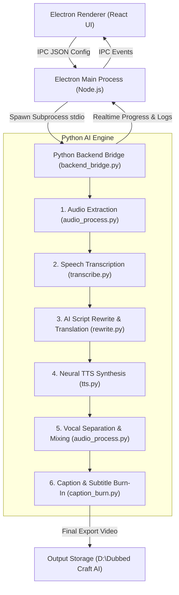

# 🎬 DubCraft AI Studio — Complete Technical Documentation

---

## 📌 Executive Summary

**DubCraft AI Studio** is a state-of-the-art, desktop-native video dubbing, script translation, voice synthesis, and caption burn-in suite. Built using **Electron JS**, **React (Vite)**, and a **Python AI Backend Engine**, DubCraft AI Studio automates the entire end-to-end video localization pipeline—allowing content creators, localization teams, and video editors to transform videos into 45+ languages in minutes.

Key capabilities include:
- **Automatic Speech Recognition (ASR)** via OpenAI Whisper / CTranslate2.
- **Context-Aware AI Script Translation & Alignment** using Anthropic Claude & OpenAI GPT models.
- **Neural Text-To-Speech (TTS)** voiceover synthesis via Microsoft Edge-TTS & ElevenLabs with custom voice actor presets, rate, and pitch controls.
- **Vocal Separation & Background Music Preservation** via Demucs & FFmpeg ducking algorithms.
- **Hardcoded Subtitle & Caption Burn-In** with custom fonts, ASS/SRT formatting, and dynamic visual styling.
- **Full Offline Batch Processing Pipeline** with realtime streaming console logs and IPC progress tracking.

---

## 🏗️ Architecture & System Topology

DubCraft AI Studio follows a decoupled **Decentralized IPC Architecture**, bridging Electron's Chromium Renderer Process with a heavy-duty Python AI Processing Engine via asynchronous standard input/output (stdio) IPC channels.



---

## 🧩 Core Modules & Pipeline Mechanics

### 1. Smart File Path Resolver & Ingestion (`python/backend_bridge.py`)
- Automatically scans system drives (`D:\`, `Downloads`, `Desktop`, `Videos`) if raw video paths are missing or moved.
- Manages temporary processing workspaces in `D:\Dubbed Craft AI\temp_dubbing`.

### 2. Speech-To-Text Engine (`python/transcribe.py`)
- Uses **Whisper** (tiny, base, small, medium, large-v3) or **Whisper-Timestamped** to extract exact word-level time codes.
- Outputs structured `transcript.json` and standard `.srt` / `.vtt` formats.

### 3. AI Script Rewrite & Translation (`python/rewrite.py`)
- Leverages **Anthropic Claude API** (`claude-3-5-sonnet`) / **OpenAI API** (`gpt-4o`) / **Google Gemini API** (`gemini-1.5-pro`) to rewrite audio scripts.
- Ensures translated scripts match original spoken duration (lip-sync alignment) while maintaining natural grammar in 45+ target languages.

### 4. Neural Voiceover Synthesis (`python/tts.py`)
- Integrates **Edge-TTS** (free, neural, zero-config) and **ElevenLabs AI** for hyper-realistic voice replication.
- Supports voice actor selection (male, female, neutral), pitch shifting (`-5Hz` to `+5Hz`), and speed adjustment (`0.8x` to `1.3x`).

### 5. Audio Processing & Track Mixing (`python/audio_process.py`)
- **Demucs Vocal Separation**: Separates original background music (BGM) and ambient noise from vocals.
- **Ducking & Track Mixing**: Automatically ducks original voice and mixes newly generated TTS audio over the original background music track using FFmpeg filters.

### 6. Subtitle & Subtitle Burn-In Engine (`python/caption_burn.py`)
- Generates Advanced SubStation Alpha (`.ass`) and SubRip (`.srt`) files.
- Hardcodes stylized captions directly onto the video using FFmpeg libass filter with customizable font size, outline, shadow, primary color, and positioning.

---

## 🖥️ User Interface Overview

The frontend is built with React 18 and styled using a modern **Dark Glassmorphism Design System**:

| UI Module | Path | Functionality |
| :--- | :--- | :--- |
| **Queue View** | `src/renderer/components/QueueView.jsx` | Drag-and-drop video file ingestion, batch dubbing progress bars, status tags (Queued, Transcribing, Translating, Synthesizing, Completed). |
| **Presets View** | `src/renderer/components/PresetsView.jsx` | Quick language selection, subtitle style toggles, target voice presets. |
| **Settings Manager** | `src/renderer/components/SettingsView.jsx` | Configuration of Anthropic/OpenAI API keys, export directory paths, Whisper model sizes, GPU acceleration switches. |
| **Console View** | `src/renderer/components/ConsoleView.jsx` | Real-time terminal log viewer displaying stdout/stderr stream from Python backend processes. |
| **Sidebar & Header** | `src/renderer/components/Sidebar.jsx` | Navigation, status system indicators, hardware stats monitor. |

---

## ⚙️ Configuration & Environment Setup

### System Requirements

- **Operating System**: Windows 10/11 (64-bit recommended)
- **Processor**: Intel Core i5 / AMD Ryzen 5 or higher
- **RAM**: 8 GB minimum (16 GB recommended for Whisper Large models)
- **Storage**: 5 GB free disk space (excluding video output)
- **External Dependencies**: [FFmpeg](https://ffmpeg.org/) (installed and added to System Environment PATH)

### API Key Setup (`.env`)

To enable advanced AI script rewrites and premium TTS, create a `.env` file in the project root:

```env
ANTHROPIC_API_KEY=your_anthropic_api_key_here
OPENAI_API_KEY=your_openai_api_key_here
GEMINI_API_KEY=your_gemini_api_key_here
ELEVENLABS_API_KEY=your_elevenlabs_api_key_here
```

---

## 📁 Repository Directory Layout

```
Video Dubbing Tool/
├── .gitignore
├── Launch DubCraft AI.bat         # 1-Click Launch script for Windows
├── Launch DubCraft AI (Silent).vbs# Silent Background Launcher
├── package.json                   # Node.js dependencies & scripts
├── README.md                      # GitHub Repository Overview
├── vite.config.js                 # Vite bundler configuration
├── docs/
│   └── DOCUMENTATION.md           # Professional Technical Documentation
├── python/
│   ├── backend_bridge.py          # Master IPC python execution coordinator
│   ├── transcribe.py             # Whisper ASR transcription engine
│   ├── rewrite.py                # LLM translation & script alignment
│   ├── tts.py                    # Edge-TTS & ElevenLabs voice synthesizer
│   ├── audio_process.py          # Demucs vocal separation & FFmpeg audio mixing
│   ├── caption_burn.py           # Subtitle burn-in & ASS generator
│   ├── downloader.py             # yt-dlp & URL video downloader
│   └── requirements.txt          # Python dependency manifest
└── src/
    ├── main/
    │   ├── main.js               # Electron main process & IPC handlers
    │   └── preload.js            # Secure IPC renderer bridge
    └── renderer/
        ├── App.jsx               # Main React Layout Container
        ├── main.jsx              # React Entrypoint
        ├── index.css             # Glassmorphism Design System CSS
        └── components/
            ├── Header.jsx
            ├── Sidebar.jsx
            ├── QueueView.jsx
            ├── PresetsView.jsx
            ├── SettingsView.jsx
            └── ConsoleView.jsx
```

---

## 🛠️ Developer Installation & Deployment

### 1. Development Mode

```bash
# Install Node.js packages
npm install

# Setup Python Virtual Environment
python -m venv venv
.\venv\Scripts\Activate.ps1
pip install -r python/requirements.txt

# Start Electron + React Dev Server
npm run dev
```

### 2. Production Build

To build a standalone executable installer for Windows:

```bash
npm run dist
```

Built executables and unpacked binaries will be stored in `dist_electron/`.

---

## ❓ Diagnostic & Troubleshooting FAQ

#### Q1: "FFmpeg is not recognized as an internal command"
> **Solution**: Download FFmpeg from [ffmpeg.org](https://ffmpeg.org/), extract it to `C:\ffmpeg`, and add `C:\ffmpeg\bin` to your System PATH environment variables.

#### Q2: Python backend process exits with code 1
> **Solution**: Ensure your virtual environment (`venv`) is initialized and all requirements in `python/requirements.txt` are installed (`pip install -r python/requirements.txt`).

#### Q3: Subtitles are misaligned or overlapping
> **Solution**: Open **Settings Manager** in DubCraft AI Studio and adjust the **Subtitle Max Characters Per Line** to `35` and **Subtitle Margin V** to `40`.

---

© 2026 **DubCraft AI Studio**. Designed & Developed for High-Performance Video Dubbing.
